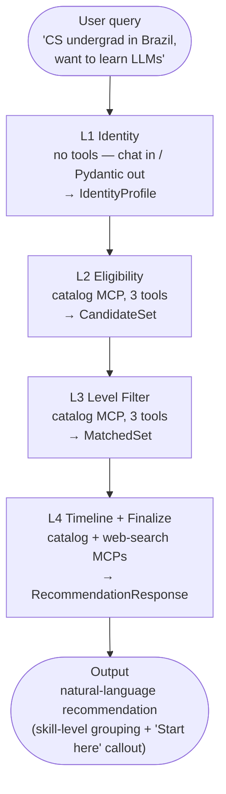

# Lumi

> **Mission**: Help students worldwide access free AI learning resources
> (courses, competitions, API credits, GPU environments) by removing
> financial, geographic, and informational barriers.

A multi-agent system built for the
[Kaggle AI Agents: Intensive Vibe Coding Capstone Project](https://kaggle.com/competitions/vibecoding-agents-capstone-project)
— track: **Agents for Good**.

Author: [`kannch8765`](https://github.com/kannch8765) · Repo:
[`github.com/kannch8765/lumi`](https://github.com/kannch8765/lumi) ·
Writeup: [`writeup/WRITEUP_KAGGLE.md`](./writeup/WRITEUP_KAGGLE.md) (1,982 words · Kaggle submission) ·
Full: [`writeup/WRITEUP.md`](./writeup/WRITEUP.md) (7,324 words · repo docs)

---

## The problem

Free AI learning opportunities exist but are scattered, transient, and
hard to qualify for. A CS undergraduate in Recife, a self-taught developer
in Lagos, and a high-schooler in Manila all want access to GPU notebooks,
LLM API credits, structured courses, and competitions — but each faces a
different combination of barriers:

- **Age** — Kaggle's free tier is unavailable under 18; some credits
  require a phone-verified account.
- **Country** — Zindi is global but Africa-focused; some competitions
  restrict specific regions.
- **Institution** — a few `.edu`-only resources; some require SSO.
- **Prerequisites** — math, Python, ML background; course sequencing.
- **Deadlines** — competitions close; course seats fill; credits expire.
- **Language** — primary materials are English; some great courses are
  in Mandarin, Japanese, Spanish, Portuguese.

The eligibility matrix is the matrix: `age × country × institution ×
prerequisites × deadlines × language`. It changes every month. It cannot
be served by a static FAQ.

## What Lumi does

A four-agent pipeline (L1–L4) that turns *"I'm a CS undergrad in Brazil, want
to learn LLMs"* into a ranked shortlist of resources the user can
**actually use this week** — filtered by eligibility, matched to skill
level, annotated with deadlines and freshness.



> **Refactor 2026-06-24:** Pipeline is 4 layers (L1 → L2 → L3 → L4). The
> former timeline ranker + L5 Synthesizer were absorbed into L4 Timeline
> + Finalize. URGENCY buckets (CRITICAL/HIGH/MEDIUM/LOW/STALE) are kept
> as **internal classification only** — the user-facing markdown uses
> natural language, never bucket headers (sou 2026-06-25 feedback).
> See [`ARCHITECTURE.md`](./ARCHITECTURE.md) for the full design.

Full architecture (per-layer details, MCP tool filters, schema contracts)
lives in [`ARCHITECTURE.md`](./ARCHITECTURE.md). The `app/ranking.py`
library is **retained for future Phase G** (real-time web-search
deployment) but is **not wired into the orchestrator** — L4 emits
`RecommendationResponse` directly.

## Why an agent (not a website)

A website asks the student to filter themselves, and most students
filter wrong — they click the first GPU offer without checking the age
rule, or sign up for a competition in a country the sponsor just
restricted. Lumi extracts a `UserProfile`, runs eligibility and level
rules **deterministically in code**, and only shows what the student
can actually use. The hard work is in the *matching*, not the *display*.

The eligibility dictionary lives in **code**, not in the prompt, so the
LLM cannot "be more inclusive" and skip a rule. The tool whitelist (the
`McpToolset(tool_filter=...)` parameter) is the kill switch — Lumi cannot
browse arbitrary URLs, cannot pay, cannot create accounts. See
[`CONTEXT.md §Hard Rules`](./CONTEXT.md) for the full rule list and
[`threat_model.md`](./threat_model.md) for the 41-row STRIDE threat catalog.

When the pipeline needs more information (e.g. missing age, missing skill level), the relevant layer sets a flat state['ask_back'] key, the orchestrator short-circuits downstream agents, and the user sees a single natural-language clarification question — never an empty result or a JSON dump.

## Quickstart

### Prerequisites

- Python 3.11+ (3.12 recommended — `uv` lockfile pins to 3.12)
- [`uv`](https://github.com/astral-sh/uv) (package manager)
- A Gemini API key ([AI Studio](https://aistudio.google.com/apikey))
  — or a Google Cloud project with Vertex AI enabled

### Install

```bash
git clone https://github.com/kannch8765/lumi.git
cd lumi
uv sync
```

### Configure

Create `.env` (gitignored, mode 600):

```bash
chmod 600 .env
cat > .env <<'EOF'
GEMINI_API_KEY=your-key-here
EOF
```

### Run — three ways

```bash
# 1. Single-query CLI (full pipeline, ~10-15s for 4 layers)
uv run adk run app/agents "I'm a high school student in Brazil, want to learn ML free"

# 2. Browser chat UI (FastAPI + ADK web UI on http://localhost:8000/dev-ui)
uv run adk web app/agents --port 8000

# 3. Programmatic (Python)
uv run python -c "
import asyncio
from app.orchestrator import run_lumi_query
print(asyncio.run(run_lumi_query('CS undergrad in Brazil, want to learn LLMs')))
"
```

All three paths share `app/orchestrator.py:create_lumi_pipeline()` —
the same `SequentialAgent` returned to ADK's `Runner`.

## Project structure

```
lumi/
├── ARCHITECTURE.md            # Full architecture (4-layer pipeline + L0-L5 controls)
├── CONTEXT.md                 # Hard rules for every contributor (incl. AI agents)
├── TECH_STACK.md              # Tech choices + rationale
├── threat_model.md            # 41-row STRIDE catalog
├── LICENSE                    # MIT License (Copyright 2026 Sou)
├── writeup/
│   ├── WRITEUP.md             # Full 7,324-word design narrative (repo docs)
│   ├── WRITEUP_KAGGLE.md      # Kaggle submission version (1,982 words, ≤ 2,000 cap)
│   ├── KAGGLE_SUBMISSION.md   # Copy-paste cheat sheet for the Kaggle web form
│   ├── VIDEO_STORYBOARD.md    # 5-beat video storyboard
│   ├── ASCII_DIAGRAMS.md      # ASCII architecture diagrams
│   ├── cover_horizontal.png   # 16:9 Kaggle cover (2000x1126, 80 KB)
│   ├── cover.pptx             # Editable cover source (pptxgenjs)
│   ├── cover.png              # Vertical cover (legacy)
│   └── kaggle_competition_brief.md
├── app/
│   ├── orchestrator.py        # create_lumi_pipeline() — SequentialAgent factory
│   ├── ranking.py             # Library — code-only sort, retained for Phase G (not wired in)
│   ├── agents/
│   │   ├── agent.py           # root_agent = create_lumi_pipeline() (ADK CLI discovery)
│   │   ├── l1_identity.py     # Layer 1 — IdentityProfile + intent routing
│   │   ├── l2_eligibility.py  # Layer 2 — country/age/institution/language rules
│   │   ├── l3_level.py        # Layer 3 — fit_score [0.0, 1.0]
│   │   ├── l4_timeline.py     # Layer 4 — timeline + final markdown emit
│   │   ├── schemas.py         # Pydantic contracts (IdentityProfile, EligibilityResult, ...)
│   │   └── _tool_filters.py   # MCP tool whitelists (kill switch)
│   └── mcp_servers/
│       ├── resource_catalog/  # Curated catalog MCP (60 free resources)
│       └── web_search/        # Bounded search MCP (snippet-only)
├── tests/
│   ├── unit/                  # 380 unit + integration tests (Pydantic, MCP servers, injection defenses)
│   └── integration/
│       ├── test_pipeline_e2e.py    # End-to-end happy path (real Gemini call)
│       ├── test_l1_router.py       # Intent routing + target_agents
│       ├── test_orchestrator.py    # Pipeline wiring + sub-agent order
│       ├── test_ask_back_callback.py # ask_back short-circuit
│       └── test_catalog_loading.py # Catalog MCP load
├── deploy/
│   ├── deploy.sh              # Cloud Run deploy script (test-deploy-then-tear-down)
│   └── README.md              # Deploy runbook + 5 real gotchas
├── resources/
│   └── catalog.json           # 60 curated entries (50 standard + 10 absolute-beginner explainers)
├── scripts/pre_commit_hooks/  # lumi_guard (author + banned paths + personal-info scrub)
├── cloudbuild.yaml            # Cloud Build → Artifact Registry → Cloud Run
├── Dockerfile                 # uv-based container, MCP stdio subprocesses via sys.executable
├── pyproject.toml
└── .pre-commit-config.yaml    # 9 hooks (ruff, semgrep, pytest, lumi_guard)
```

## Testing

```bash
# Unit + integration tests (380 passed, 12 deselected for E2E + manual)
uv run pytest -m "not manual" -q

# Pre-commit hooks (9 hooks: ruff, semgrep, pytest, lumi_guard)
uv run pre-commit run --all-files

# Adversarial injection tests (per L-layer)
uv run pytest tests/unit/test_l1_prompt_injection.py -v
uv run pytest tests/unit/test_l2_prompt_injection.py -v
uv run pytest tests/unit/test_l3_prompt_injection.py -v
uv run pytest tests/unit/test_l4_prompt_injection.py -v
```

## Deployment

Lumi is containerized and Cloud-Run-ready. We use a **test-deploy-then-tear-down**
strategy: deploy once, verify the pipeline runs end-to-end, capture gotchas,
then delete the service so no public URL remains. The deploy runbook +
5 real gotchas are in [`deploy/README.md`](./deploy/README.md).

```bash
# Full deploy (Cloud Build → Artifact Registry → Cloud Run)
cp .env.production.example .env.production   # add your keys
chmod 600 .env.production
./deploy/deploy.sh

# Verify
SERVICE_URL=$(gcloud run services describe lumi --format='value(status.url)')
curl -s "$SERVICE_URL/list-apps"
# → ["agents"]

# Tear down
gcloud run services delete lumi --region=us-central1
gcloud artifacts repositories delete lumi --location=us-central1
```

## Documentation

| Document | Purpose |
|---|---|
| [`ARCHITECTURE.md`](./ARCHITECTURE.md) | Full architecture, per-layer details, MCP tool filters, ask_back pattern |
| [`CONTEXT.md`](./CONTEXT.md) | Hard rules every contributor must follow (incl. AI agents writing code) |
| [`TECH_STACK.md`](./TECH_STACK.md) | Tech choices + rationale (Python 3.12, ADK, MCP, uv, semgrep, pre-commit) |
| [`threat_model.md`](./threat_model.md) | 41-row STRIDE catalog — the spec the test suite asserts against |
| [`writeup/WRITEUP.md`](./writeup/WRITEUP.md) | Full 7,324-word design narrative (repo docs) |
| [`writeup/WRITEUP_KAGGLE.md`](./writeup/WRITEUP_KAGGLE.md) | Kaggle submission writeup (1,982 words, ≤ 2,000 cap) |
| [`deploy/README.md`](./deploy/README.md) | Cloud Run deploy runbook + 5 real gotchas |

## License

[MIT](./LICENSE) — Copyright 2026 Sou. Free to use, modify, and distribute
with attribution.
